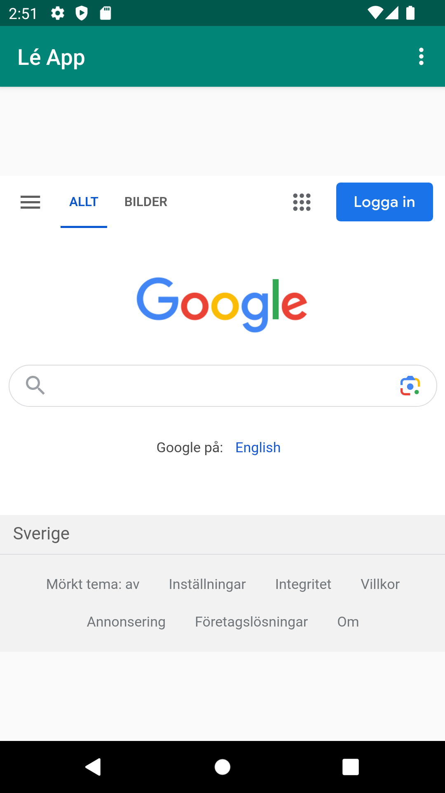

# Rapport

**Skriv din rapport här!**

_Du kan ta bort all text som finns sedan tidigare_.


1.Jag ändrade namnet på sidan "Lé App"


2. Jag ändrade koden så att jag kan använda mig av internet
3. skapade assets file och sedan skapade jag about.html.
4. import webview och adderade private webview för att se till att sidorna google och min about.html
skapades.
5. sedan adderade jag showinternalwebpage för att koden ska synas.
```

{

   <string name="app_name">Lé App</string>
 

 
 kod: 
  <uses-permission android:name="android.permission.INTERNET" />
  
  
  
 
  
  kod: 
   private WebView myWebView;
   
   import android.webkit.WebView;
import android.webkit.WebViewClient;
myWebView.loadUrl("file:///android_asset/about.html");
  myWebView = findViewById(R.id.my_webview);
        myWebView.setWebViewClient(new WebViewClient()); // Do not open in Chrome!
        myWebView.loadUrl("https://his.se");
}

 
  
  kod: Log.d("==>","Will display internal web page");
            showInternalWebPage();
```


Bilder läggs i samma mapp som markdown-filen.



